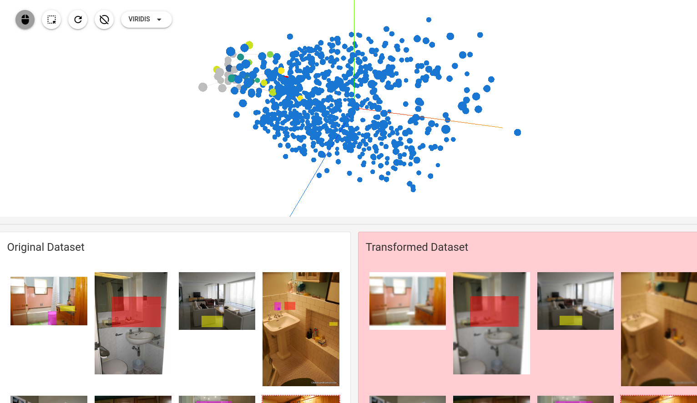

=============
NRTK EXPLORER
=============

NRTK Explorer is a web application for exploring image datasets. It provides
insights of a image dataset in _COCO format and it evaluate image
transformation and perturbation resilience of object recognition DL models. It
is built using _trame by the _kitware team.

Features
--------

- Explore image datasets in COCO format.
- Apply parametrized image degradation (such as blur) to the images.
- Benchmark dataset resilience with a differential PCA|UMAP analysis of the
  embeddings of the images and its transformation.
- Evaluate object detection DL models in both the source images and its
  transformations.
- When possible it will attempt to utilize the user GPU as much as possible to
  speedup its computations.

Installing
----------

Download the application with:

.. code-block:: console

    curl -OL https://github.com/Kitware/nrtk-explorer/archive/refs/heads/main.zip

Inside the application source code top directory, install it with:

.. code-block:: console

    pip install -e .

Run the application:

.. code-block:: console

    nrtk_explorer

CLI flags and options
---------------------

- `-h|--help` show the help for the command line options, it inherit trame
  command line options and flags.
- `--dataset` specify the directory containing a json file describing a COCO
  image dataset. You can specify multiple directory using a comma `,` as a
  separator.

Contribute to NRTK_EXPLORER
---------------------------

Run tests with:

.. code-block:: console

    pytest

.. _trame: https://trame.readthedocs.io/en/latest/
.. _kitware: https://www.kitware.com/
.. _COCO: https://cocodataset.org/
