# Advanced Usage

## Flags

NRTK Explorer has various flags that can be used to customize the app before launching. Running the following command
will display all available flags:

``` bash
    nrtk-explorer -h
```

## Components

NRTK Explorer can be split into seven different components: datasets, embeddings, export, filtering, images, inference,
and transforms. Each of the components can be enabled and disabled individually with the `--features` flag. If a feature
is not listed after the flag, the associated component will be disabled. To launch NRTK Explorer with the datasets and
images components, use the following command:

``` bash
    nrtk-explorer --features datasets images
```

### Datasets

The datasets component is located on the left side of the screen and controls the dataset being visualized. The image below
is an example of the datasets component in an example app. The dropdown selector can be used to change which dataset is
being visualized. There is a slider to change the number of images shown by the app. Lastly, there is a
_Random sampling_ switch that will take a random sample of images based on the slider.

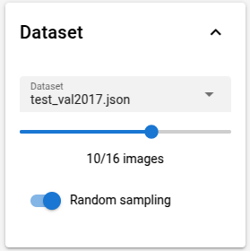

### Embeddings

The embeddings component is made up of two widgets: settings and visualization. The first image below is the settings
panel and the second image is the visualization plot.

Looking at the settings first, there is a switch next to the _Embeddings_ title.
This will turn off the visualization plot. The settings panel has a 2D and 3D toggle which changes the visualization
plot to be in 2D or 3D. The _Embeddings Model_ dropdown changes which model is for the PCA and UMAP calculations below.
Clicking on PCA or UMAP will change which values you will perform and the associated settings. Lastly, the _Compute_
button will execute the calculate the selected values based on the settings you chose.

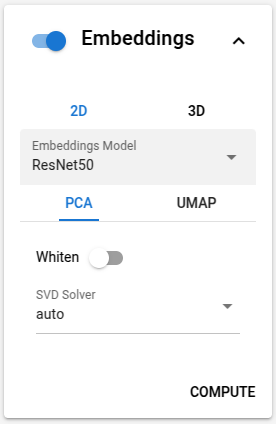

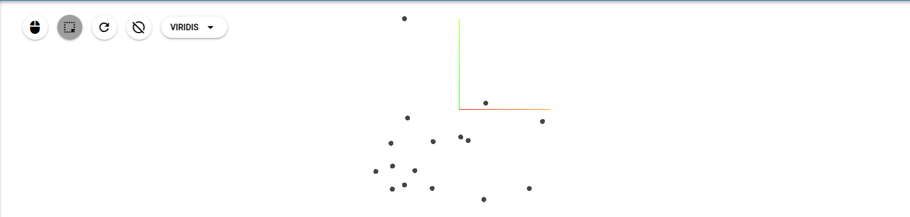

### Export

The export component is used to export the transformed dataset.

### Filtering

The filtering component is used to filter images based on the categories in the dataset. The list of categories can be
selected to limit the images displayed to only contain the selected categories. The && and || buttons will toggle
between and and or filtering for the categories. If && is selected, then the image must have all of the categories to be
included. If || is selected, then an image must have at least one category to be included. The ! toggle button will
invert the filter. Lastly, the _SELECT IMAGES_ button will apply the filter to the dataset.

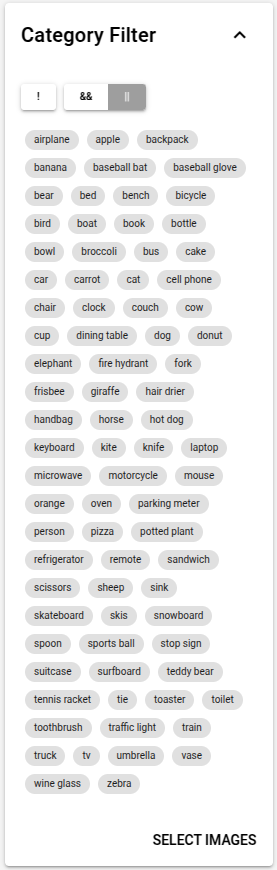

### Images

The images component displays all images with their dataset ID. There are additional columns that can be displayed using
the _COLUMNS_ dropdown. We will discuss these columns when we get to the component that modifies them. Image size can be
changed using the _Image Size_ slider. Annotations are displayed by default and can be turned off with the
_Show Annotations_ switch. Instead of a table, you can visualize the dataset as a grid of images. Lastly, the search bar
allows for users to search for images based on ID.

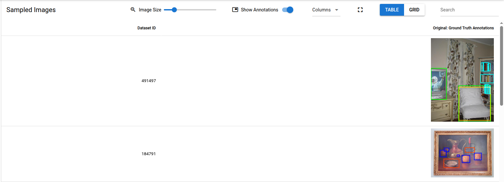

### Inference

The inference component allows for users to run different models to detect object in the original image. The switch next
to _Model Inference_ will enable or disable the component. When enabled, the generated annotations will be displayed in
the images component with a similarity score as shown below. The _Inference Model_ dropdown will change which model is
used to detect objects in the image. Lastly, the _Confidence score threshold_ slider is used to determine the minimum
required score for the annotation to be displayed.

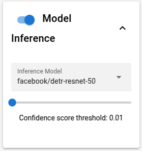

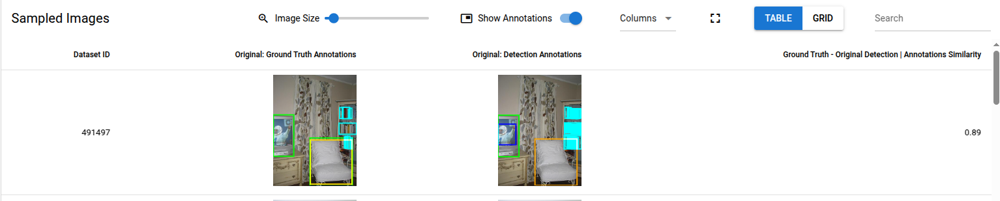


### Transforms

The transforms component allow for NRTK-based augmentations to be applied to all images in the dataset. The switch next
to _Transform_ will enable or disable the component. When enabled, images section will display a new, augmented image
and similarity scores. Each transform has two parts: the transform dropdown and settings. The dropdown contains all
supported NRTK augmentations and a few basic transforms. The settings are transform specific and allow the user to
customize the augmentation. The _ADD TRANSFORM_ button adds additional transforms to apply to an image. Lastly, the
_APPLY TRANSFORMS_ button will apply all transforms in order. This can some time depending on the amount of image
transformed and the complexity of transformations.

> **_NOTE:_**  If Inference is not enabled, the annotations cannot be generated for augmented images.

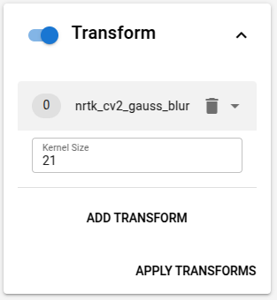

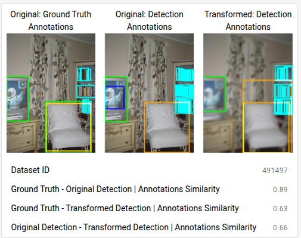

The augmented images are also displayed in the embeddings visualization plot it enabled. This shows how the images have
changed in the feature space. The augmented dots are color coded based on how different the original image and augmented
image are.

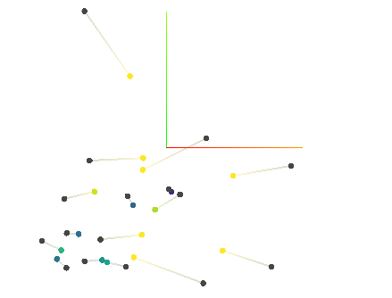

## Preset Configurations

As mentioned before, presets are configured combinations of components for various use cases. Currently there are three
presets: none, images, all. NRTK explorer presets can configured using the `--preset PRESET` command

### None

The none preset will load NRTK Explorer with none of the components enabled. This is strictly used for debugging issues
with launching the trame app. The following command can be used to launch NRTK Explorer with the none preset:

``` bash
    nrtk-explorer --preset none
```

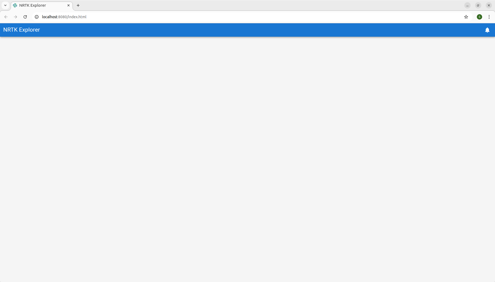

### Viewer

The viewer preset enables the datasets, filters, and images components. This is a light-weight version of NRTK Explorer
that focuses on exploring a dataset. The following command can be used to launch NRTK Explorer with the viewer preset:

``` bash
    nrtk-explorer --preset viewer
```

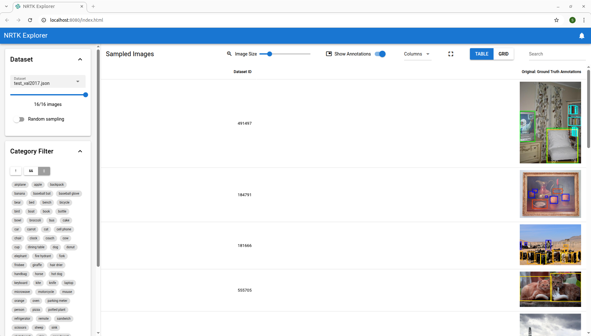

### All

The all preset enables all components. This is the default preset shown if launched without defining a preset. Since all
components are enabled, start up time can be longer than the viewer preset. The following commands can be used to launch
NRTK Explorer with the all preset:

``` bash
    nrtk-explorer
```

or

``` bash
    nrtk-explorer --preset all
```


