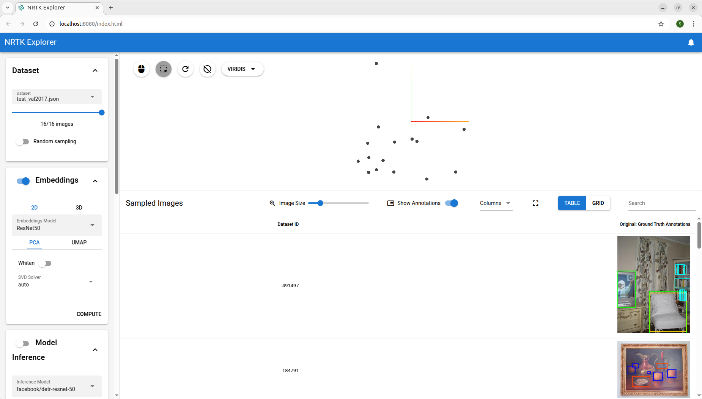

# Usage

NRTK Explorer allows for a user to visualize a dataset and apply NRTK-based augmentations to the entire dataset. The
following command will launch NRTK Explorer:

``` bash
    nrtk-explorer
```

For more information on launch options for NRTK Explorer, see [Flags](./advanced_usage.md#flags) in _Advanced Usage_.


The image below is NRTK Explorer using the command above.



The app can be split into two main sections: the settings
column on the left side and the visualization section on the right side. The settings column allows user to change how many or
what kind of images they are observing, customize analysis of the dataset, and choose augmentations they want to apply
to the images in the dataset. The visualization section contains two main components: a feature space containing the
images in the dataset and a table containing information about each image in the dataset. For the most part, changes
made in the settings column will change parts of the visualization section. For more information on specific components
of NRTK explorer, see see [Components](./advanced_usage.md#components) in _Advanced Usage_.
